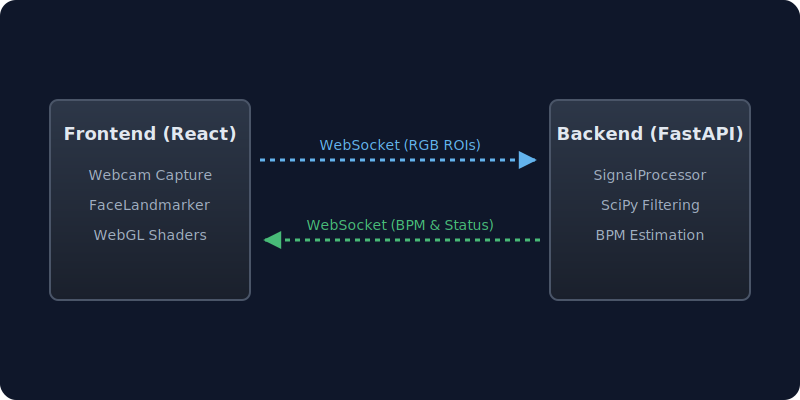

  

# PulseCam Architecture

This document details the system architecture, data flow, and signal processing pipeline used in PulseCam.

## 🏗️ System Overview

PulseCam operates on a client-server model connected via WebSockets to enable real-time, low-latency video frame analysis without the overhead of HTTP requests.

### 1. Frontend (React / WebGL)
- **Webcam Capture:** Accesses the user's camera via `getUserMedia` and captures frames at a target 30 FPS.
- **Camera Lock (best-effort):** After the stream starts, attempts to lock `exposureMode`, `whiteBalanceMode`, and `focusMode` to `manual` via `applyConstraints`. This silently no-ops on cameras/browsers that don't expose these capabilities (e.g. Chrome on macOS for built-in MacBook cams) — works on iPhones via Continuity Camera and on many external webcams.
- **Client-side Processing:** The frontend uses MediaPipe FaceLandmarker locally to track facial landmarks and extract trimmed-mean RGB from three skin Regions of Interest (forehead, left cheek, right cheek), plus a non-skin background reference, frame-level luminance, and motion metric. This compresses each frame to compact color statistics instead of streaming video.
- **WebSocket Client:** Streams the per-frame ROI payload to the backend.
- **UI & Visualization:** Renders the real-time waveform and calculated BPM using `framer-motion` and WebGL shaders for the background.

### 2. Backend (FastAPI / WebSockets)
- **WebSocket Server:** Receives continuous streams of RGB data from the frontend.
- **Signal Processor (`SignalProcessor`):** Maintains a rolling buffer of RGB values and timestamps. It dynamically calculates the effective FPS to ensure accurate frequency analysis.
- **Extraction Pipeline:** Applies 5 different rPPG extraction algorithms in parallel.
- **Response:** Sends back the calculated BPM, signal confidence, current status (`buffering`, `measuring`, etc.), and debug diagnostics such as effective FPS and luminance-artifact score.

## 🧬 Signal Processing Workflow

The core of PulseCam is the `SignalProcessor`, which isolates the tiny color changes in the skin from background noise and motion artifacts.

### 1. Signal Extraction
For every frame, skin RGB is first normalized against the optional non-skin background reference. The background signal is regressed out of each skin color channel to reduce shared auto-exposure and room-light modulation before rPPG extraction. We then extract several signals from the corrected RGB values:
- **Green Channel:** The simplest rPPG signal, as hemoglobin absorbs green light effectively.
- **Chrominance (CHROM):** Projects RGB into a chrominance space to eliminate specular reflection (lighting changes).
- **POS (Plane-Orthogonal to Skin):** Another projection method highly robust to motion.
- **GR & GRGB:** Ratio-based signals that normalize against the red and blue channels.

Before extraction, each signal is detrended with an edge-corrected moving average (the convolution is normalized by local kernel overlap, so the most-recent samples — where the spectrum is read — aren't biased toward zero by the implicit zero-padding of `np.convolve`).

### 2. Filtering
Each extracted signal passes through a **6th-order Butterworth bandpass filter (0.65–4.0 Hz)**, applied zero-phase via `sosfiltfilt`. The cutoffs match the rPPG literature consensus (Sasaki et al.; Pirzada et al.) and admit cardiac frequencies from ~42 BPM up to ~240 BPM while rejecting respiration harmonics below and motion drift above.

### 3. BPM Estimation
Each filtered signal is fed to two estimators in parallel, then the results are fused:
- **Welch's PSD with Harmonic Product Spectrum (HPS):** The PSD is zero-padded (`nfft = max(8 × nperseg, 1024)`) for ~1.8 BPM bin resolution, then multiplied element-wise by a 2×-decimated copy of itself. This rewards candidate frequencies whose 2nd harmonic has spectral support — true cardiac signals are non-sinusoidal and have measurable harmonics; sub-cardiac noise (e.g. webcam auto-exposure modulation around 0.7–0.9 Hz) usually does not. The peak is then refined by **parabolic interpolation** for sub-bin accuracy.
- **Autocorrelation:** Picks the strongest peak in the lag region corresponding to 42–180 BPM (rather than the first peak above threshold), then refines via parabolic interpolation. Good at finding periodicity even when the spectrum is smeared.
- **Fusion:** When both methods agree closely (ratio < 1.15), they're averaged with a confidence boost; mild disagreement uses a plain mean; strong disagreement falls back to the higher-quality method with reduced confidence.

### 4. Method Selection & Agreement
- The system computes the **SNR** of each filtered channel (in-band power vs. residual variance).
- A cluster-based agreement score finds the best-agreeing subset of the 5 method BPMs (spread within ~12 BPM, weighted by cluster size).
- The skin luminance buffer is analyzed as an artifact reference. If a strong 42–65 BPM luminance artifact is present, methods tracking that artifact are removed before final selection; if too few clean methods remain, the system reports `poor_signal`.
- When 3+ methods agree, the displayed BPM is an **SNR-weighted average** of the cluster (`weight = exp(SNR_dB)`), so high-SNR channels (typically CHROM/POS under good lighting) dominate over noise-dominated channels.

### 5. Final Calculation & Calibration
- A confidence score is generated from SNR, method agreement, and a motion penalty. The SNR threshold gates the entire output — if the best method's SNR is below 0 dB, the system returns `poor_signal` rather than a confident-but-wrong number.
- The first ~15 seconds are gated as `buffering` so that the Welch spectrum has time to consolidate against ambient noise before any reading is shown. This prevents the early-noise-dominated reading from anchoring the EMA.
- After calibration, the displayed BPM is a median-filtered + EMA-smoothed version of the per-cycle estimate.
- At session end, the frontend computes a weighted average over the last 15 seconds of confidence-gated readings as the final reported BPM.

## 🚢 Deployment Architecture
The entire application is containerized using Docker. 
- **Stage 1:** Bun builds the Vite React frontend into static files.
- **Stage 2:** Python slim image installs FastAPI, Uvicorn, SciPy, and NumPy.
- **Execution:** FastAPI mounts the static files from the frontend build and serves them on the root (`/`), while simultaneously listening on `/ws` for WebSocket connections.
- Hosted effortlessly on **Hugging Face Spaces** as a single Docker Space.
